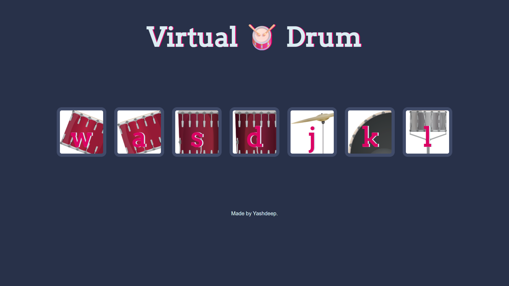

# Virtual Drum Kit 🥁

A simple interactive drum kit made with HTML, CSS, and JavaScript. Press keys or click the drums to play sounds!

## 🖼️ Screenshot


## 🔗 Live Demo
If you host it:  
[Click Here](https://yashdeep7.github.io/VirtualDrum/)

## 🛠️ Built With
- HTML5  
- CSS3  
- JavaScript

## 🚀 How to Run Locally
1. Clone the repo  
   ```bash
   git clone https://github.com/yashdeep7/VirtualDrum.git
